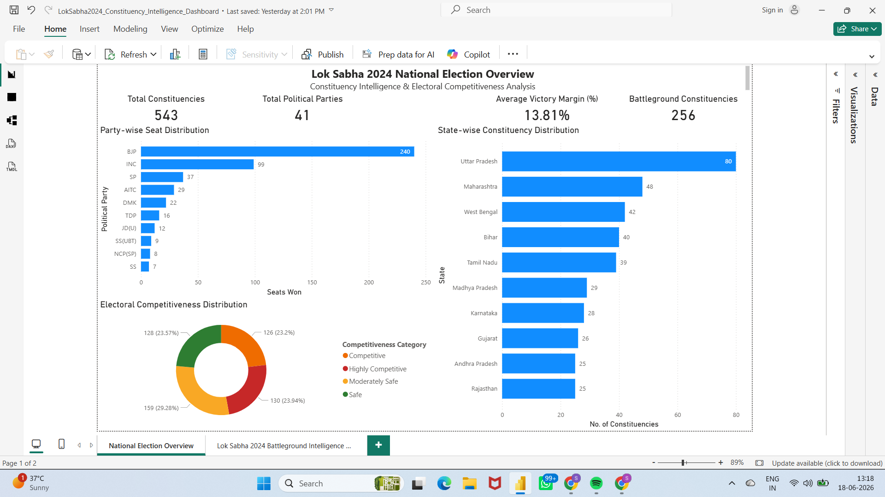
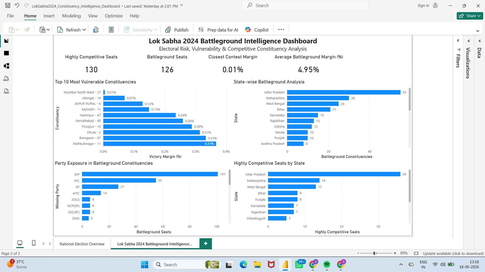

# Lok Sabha 2024 Constituency Intelligence Dashboard

## Overview

The Lok Sabha 2024 Constituency Intelligence Dashboard analyzes all 543 parliamentary constituencies from the 2024 Indian General Election.

---

## Dashboard Preview

### Page 1 – National Election Overview

### Page 2 – Battleground Intelligence Dashboard

---

## Objectives

- Analyze national election outcomes at constituency level.
- Measure electoral competitiveness using victory margin percentages.
- Identify highly competitive and battleground constituencies.
- Assess state-wise concentration of electoral risk.
- Evaluate party exposure to vulnerable constituencies.

---

## Tools & Technologies

- Microsoft Excel
- Power BI
- DAX

---

## Dashboard Structure

### Page 1 – National Election Overview

#### Key KPIs

- Total Constituencies
- Total Political Parties
- Average Victory Margin (%)
- Battleground Constituencies

#### Visuals

- Party-wise Seat Distribution
- State-wise Constituency Distribution
- Electoral Competitiveness Distribution

---

### Page 2 – Battleground Intelligence Dashboard

#### Key KPIs

- Highly Competitive Seats
- Battleground Seats
- Closest Contest Margin
- Average Battleground Margin (%)

#### Visuals

- Top 10 Most Vulnerable Constituencies
- State-wise Battleground Analysis
- Party Exposure in Battleground Constituencies
- Highly Competitive Seats by State

---

## Electoral Competitiveness Framework

| Victory Margin % | Category |
|-----------------|-----------|
| 0 – 5% | Highly Competitive |
| 5 – 10% | Competitive |
| 10 – 20% | Moderately Safe |
| >20% | Safe |

---

## Key Insights

- BJP emerged as the largest party with 240 seats.
- Uttar Pradesh has the highest number of Lok Sabha constituencies (80).
- 256 constituencies were classified as battleground seats.
- Electoral competitiveness remains concentrated in key states.
- Several constituencies were decided by margins below 1%.

---

## Author

**Saharsh Deshmukh**

Power BI | Excel | SQL | DAX | Data Analytics
